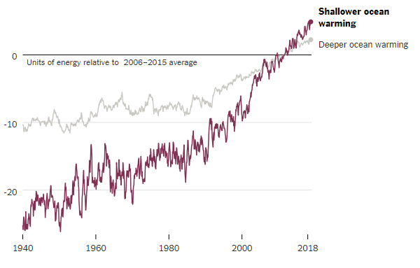

# Heat Record for Oceans set in 2018

The record for the warmest oceans was set in 2018 as the **warmest year in history** for oceans. This includes passing _2016 and 2017_ for the warmest oceans temperature. [This article](https://www.reuters.com/article/us-climatechange-oceans-temperature/ocean-temperatures-rising-faster-than-previously-thought-scientists-idUSKCN1P42KG) points out the main factors of oceans warming:

> “It’s mainly driven by the accumulation of greenhouse gases such as carbon dioxide in the atmosphere due to human activities,” said Lijing Cheng, a lead author of the study from the Chinese Academy of Sciences.

[This article](https://www.nytimes.com/2019/01/10/climate/ocean-warming-climate-change.html) captures the estimated increase in warming temperatures in oceans:

Of note:
- Sea-levels could [rise](https://www.abc.net.au/news/science/2019-01-11/ocean-warming-accelerating-faster-than-thought-science/10693080) by a significant amount in the next eighty years
- The effects of warming oceans have led to multiple [notable storms](https://globalnews.ca/news/4837893/warming-oceans-climate-change/)
- Data for water temperatures have been monitored through a [network of floats](https://www.scientificamerican.com/article/oceans-are-warming-faster-than-predicted/)
